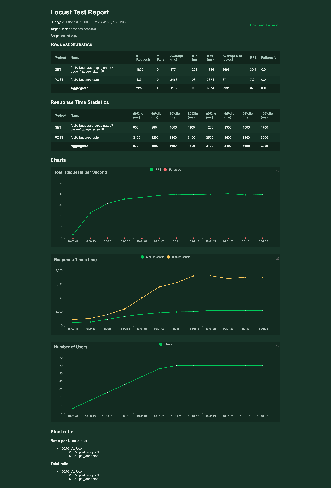

# Performance Testing with Locust

In this guide, we will explore how to set up and execute performance tests using Locust. The guide assumes that you have Python installed on your machine. Locust is a Python-based tool for performance testing that allows you to simulate users and their actions on your web application.

## Table of Contents

1. [Prerequisites](#prerequisites)
2. [Installation](#installation)
3. [Setting Up Locust File](#setting-up-locust-file)
    - [Example Locust File Explained](#example-locust-file-explained)
    - [Key Components](#key-components)
4. [Running Locust](#running-locust)
5. [Understanding Output](#understanding-output)
6. [Performance Test Report](#performance-test-report)
    - [Docker setting](#docker-setting)
    - [Testing Environment](#testing-environment)
    - [Locust Testing Parameters](#locust-testing-parameters)
    - [Observations](#observations)
7. [Troubleshooting](#troubleshooting)
8. [Conclusion](#conclusion)

---

## Prerequisites

- Python 3.x
- Basic understanding of HTTP protocols and APIs

---

## Installation

First, install Locust using pip:

```bash
pip install locust
```

This will install Locust and its dependencies.

---

## Setting Up Locust File

The main component of a Locust test is the Locust file. This Python script defines the behavior of the simulated users (also known as `Locusts`).

### Example Locust File Explained

Below is the example Locust file that we will use for this guide:

```python
import random
import string

from locust import HttpUser, events, task


def random_string(length=10):
    """Generate a random string of letters and digits"""
    letters_and_digits = string.ascii_letters + string.digits
    return ''.join(random.choice(letters_and_digits) for _ in range(length))


class ApiUser(HttpUser):
    # wait_time = between(1, 2.5)  # Wait between 1 and 2.5 seconds between tasks
    # wait_time = constant_throughput(0.1)

    @task(1)
    def post_endpoint(self):
        headers = {'Content-Type': 'application/json'}  # Assuming the API accepts JSON
        # Generate a random email address
        random_email = f'{random_string()}@example.com'
        data = {'email': random_email, 'first_name': 'First', 'last_name': 'Last'}
        # Replace 'api/endpoint' with your API endpoint
        self.client.post('/api/v1/users/create', headers=headers, json=data)

    @task(4)
    def get_endpoint(self):
        query_params = {
            'page': 1,
            'page_size': 10
        }
        # Replace 'api/endpoint' with your API endpoint for GET request
        self.client.get('/api/v1/auth/users/paginated', params=query_params)


# pylint: disable=too-many-arguments, unused-argument
# Define a failure callback
@events.request.add_listener
def my_request_handler(request_type, name, response_time, response_length, response, context, exception, start_time, url, **kwargs):
    if exception:
        print(f'Request to {name} failed with exception {exception}')
        # sys.exit(1)
```

#### Key Components

- `random_string`: A utility function to generate random strings for the email field.
- `ApiUser`: Class defining the behavior of each simulated user.
- `post_endpoint`: The actual task that each user will execute.
- `my_request_handler`: Function that listens to request events to log failures and successes.

---

## Running Locust

To run Locust, navigate to the folder where your Locust file is located and run:

```bash
locust -f your_locust_file.py
```

This will start the Locust web interface on http://localhost:8089 by default.

---

## Understanding Output

Locust provides several metrics in its web interface and logs, including:

- **RPS**: Requests Per Second
- **Users**: Number of concurrent users
- **Response Times**: Minimum, maximum, and average response times
- **Failures**: Number and type of failed requests

---

## Performance Test Report

This section details the performance testing carried out to assess the system's capabilities under stress and high-load conditions. Below is a screenshot of the test results generated by Locust.



### Docker setting

```yml
deploy:
      resources:
        limits:
          memory: 512M
          cpus: '0.5'
```

### Testing Environment

- **Machine Type**: Docker Container
- **CPU**: 0.5 vCPUs
- **Memory**: 512 RAM
- **Network**: 100 Mbps

### Locust Testing Parameters

- **Number of Users**: 60
- **Spawn Rate**: 2 users/second
- **Test Duration**: 1 minute

### Observations

- The system was stable during the test duration with zero failures across all API endpoints.
- The GET API has a faster average response time compared to the POST API, albeit slower than in the previous test.
- The system managed an aggregated RPS of 37.6 without any errors, showcasing its ability to handle a moderate load.
- The POST API took considerably longer to respond, indicating potential bottlenecks or areas that require optimization.

This data provides insights into the system's current performance capabilities, highlighting areas for further investigation and optimization.

## Troubleshooting

1. **Attribute Errors**: Ensure that you're using a compatible version of Locust.
2. **Failed Requests**: Examine the logs and modify the Locust file accordingly.

---

## Conclusion

Locust offers a powerful yet simple framework for performance testing web applications. This guide provides a basic setup to get you started with performance testing using Locust.

By understanding the metrics and optimizing your application, you can improve its performance and reliability under various loads.

For further reading, consult the [official Locust documentation](https://docs.locust.io/en/stable/).
